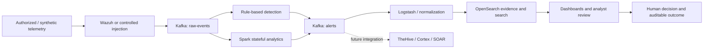

# Project Synapse

**AI-Driven Hybrid SOC Platform — from enterprise vision to proof-of-concept implementation**

Graduation project by **Mu'ath Yousef**, Tafila Technical University, 2025–2026.

Project Synapse is an open-source cybersecurity and security-data-engineering project. It combines rule-based detection with stream analytics in a modular architecture that can be evaluated on one constrained node and scaled by design into a distributed deployment.

Project Synapse is **not SOCRoot**. Synapse is assessed by technical and academic evidence; [SOCRoot](https://socroot.com) is a separate commercial initiative assessed by customer value, willingness to pay, and renewal.

## At a glance

| Track | Purpose | Current evidence boundary |
|---|---|---|
| **Enterprise Synapse** | Distributed hybrid SOC architecture using Wazuh, Kafka, Spark, OpenSearch, and modular SOAR/observability layers | Architecture and capacity model; not a deployed 90-node production system |
| **PSM** | Single-node proof of concept validating Kafka → Spark → OpenSearch streaming detection | Results are recorded in the current academic report; public reproducibility package is still being assembled |
| **Synapse Arm / CLI** | Controlled CVE lab workflow: initialize, exploit, patch, verify, preserve evidence, and report | Graduation-development plan; commands and end-to-end evidence must be verified before they are presented as implemented |

## The engineering problem

Commercial SIEM platforms offer mature capabilities but can impose high recurring cost, vendor lock-in, opaque analytics, and limits on data residency or customization. Project Synapse investigates a different model:

- treat security operations as a distributed data pipeline;
- move from **collect → store → search** toward **stream → detect → store**;
- combine explainable rules with stateful behavioral analysis;
- keep detection logic, infrastructure knowledge, and evidence reviewable;
- validate the design on constrained infrastructure before claiming enterprise scale.

## Core architecture



The enterprise design separates data collection, streaming, detection, storage, SOAR, and observability. The PSM proof of concept intentionally removes replication, high availability, and geographic distribution to test the core pipeline on one node.

## PSM evidence snapshot

The current academic deliverable reports the following controlled results:

| Measure | Reported result | Interpretation |
|---|---:|---|
| Sustained throughput | 967 events/second | 60,000 events processed in 62 seconds |
| Peak throughput | 1,200 events/second | five-second burst |
| Average end-to-end latency | 15.96 seconds | PSM micro-batch pipeline |
| P95 / P99 latency | 17.8 / 18.2 seconds | within the POC acceptance limits |
| Privilege-escalation precision | 95.9% | 47 true positives, 2 false positives |
| Recall / F1 | 94.0% / 94.9% | based on 100 labeled cases |
| Seven-day simulation | 2,847,391 events | 1,247 alerts; 99.7% reported uptime |

These figures are **report-backed, not yet independently reproduced from this public repository**. The enterprise target of 50,000–200,000 events/second is a design and capacity-planning target, not a deployed result. See the [evidence register](docs/evidence-register.md).

## Controlled CVE workflow

The graduation-development plan defines a separate lab workflow:

```text
init CVE → exploit in an isolated lab → detect → apply patch/mitigation
         → verify the exploit no longer succeeds → preserve evidence → report
```

This workflow is authorized-lab work only. Its maturity is tracked independently from the PSM streaming benchmark.

## Open-source component model

- **Wazuh and Sigma** — explainable rule-based detection;
- **Kafka** — durable, replayable event transport;
- **Spark Structured Streaming** — stateful behavioral detection and data analysis;
- **OpenSearch** — alert/evidence indexing, search, and dashboards;
- **TheHive/Cortex or a reviewed alternative** — case management and enrichment;
- **Prometheus, Grafana, OpenTelemetry, and Jaeger** — observability;
- **Docker Compose** for POC reproducibility, with a documented path toward Kubernetes.

A component appearing here or in a diagram does not prove that its end-to-end integration is complete.

## Repository map

| Concern | Canonical location |
|---|---|
| Public scope, architecture, analytics method, roadmap, and evidence register | This repository |
| Runtime/POC implementation | `Project-Synapse-SOC-Factory` — private during history and release-safety review |
| Reusable authorized utilities | `security-tools` — private and independent |
| Commercial cybersecurity services | [SOCRoot](https://socroot.com) — separate project |

## Safety invariants

1. `SOAR_DRY_RUN=true` by default.
2. Sensitive actions require explicit human approval.
3. CDN and RFC1918 addresses are never automatically blocked.
4. DNS-derived events remain `NOTIFY_ONLY`, never `BLOCK_IP`.
5. Raw operational data is not sent to external AI providers.
6. Controlled exploitation runs only in isolated, authorized labs.
7. Every approved action or experiment retains traceable evidence and rollback context.

## Maturity

**Active graduation-project documentation and prototype validation.**

The project does not claim a production deployment, guaranteed SLA, unattended remediation, certification, or independently reproduced enterprise-scale performance. Results, targets, projections, and future work are labeled separately.

## Documentation

- [Overview](docs/overview.md)
- [Architecture](docs/architecture.md)
- [Data analytics and evaluation](docs/data-analytics.md)
- [Evidence register](docs/evidence-register.md)
- [Roadmap](docs/roadmap.md)
- [Security policy](SECURITY.md)
