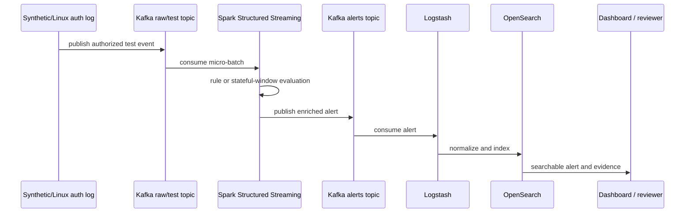
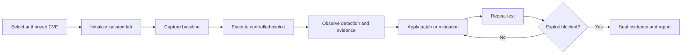

# Project Synapse Architecture

## Architecture thesis

Project Synapse treats security operations as a distributed data-pipeline problem. Instead of waiting for all events to be stored before analysis, the design prioritizes **stream → detect → store**. Durable streams preserve replay and audit capability while specialized consumers scale independently.

## Enterprise layers

| Layer | Responsibility | Candidate components |
|---|---|---|
| Data collection | endpoint, network, and authorized cloud telemetry | Wazuh agents, Snort/Suricata, API collectors |
| Streaming | durable buffering, replay, partitioning, replication | Kafka |
| Detection | explainable rules and stateful behavioral logic | Wazuh, Sigma, Spark Structured Streaming |
| Storage | indexed alerts, enriched evidence, lifecycle tiers | OpenSearch, object storage |
| SOAR | cases, enrichment, bounded response | TheHive, Cortex, Shuffle or reviewed alternative |
| Operations | metrics, traces, logs, secrets, deployment | Prometheus, Grafana, Loki, OpenTelemetry, Vault |

## PSM proof-of-concept path

The current report describes a roughly 10-second Spark micro-batch and an average end-to-end latency of about 16 seconds. This is a POC characteristic, not the enterprise target.

## Detection paths

### Rule-based path

Wazuh and Sigma provide explainable coverage for known patterns. Rule artifacts should remain readable, versioned, testable, and mapped to their input fields and expected output.

### Stateful analytics path

Spark supports time windows, grouping, watermarks, and checkpoints. The PSM report uses this for:

- a direct `sudo` shell-execution rule;
- a spike rule with a 10-second tumbling window, one-second slide, 30-second watermark, and threshold of five events.

### ML path

TensorFlow, PyTorch, Spark MLlib, or other ML tools are architectural options, not current proof. A model becomes part of the validated project only after dataset quality, leakage, baseline, metrics, inference path, drift, and feedback behavior are documented.

## Controlled CVE lab path

The development plan defines CLI verbs for `status`, `list`, `init`, `exploit`, `patch apply`, `verify`, `evidence`, and `report`. They remain planned or partially implemented until command-level tests and evidence are published.

## POC-to-enterprise evolution

| Concern | Single-node PSM | Enterprise design |
|---|---|---|
| Deployment | Docker Compose on one VM | multi-node, multi-datacenter orchestration |
| Kafka | constrained broker/topology | partitioned and replicated clusters |
| Spark | local/limited workers | multiple executors and isolated jobs |
| OpenSearch | single constrained deployment | sharded, replicated hot/warm/cold tiers |
| Availability | single point of failure | fault tolerance and recovery |
| Throughput | about 1,000 events/second reported | 50,000–200,000 events/second design target |
| Threat coverage | two POC rules | broader rule, behavior, and model portfolio |
| Evidence | academic report and private runtime | reproducible public package pending |

No row in the enterprise column is a current deployment claim.

## Contract baseline

Every normalized event should preserve:

- `event_id`, `schema_version`, and `observed_at`;
- source type and sanitized source identifier;
- authorization and scope reference;
- category, severity, and evidence reference;
- correlation/trace identifier;
- lab or tenant boundary;
- processing status and error context.

Every finding should add rule/model version, confidence or threshold, matched evidence, and limitations.

## Safety invariants

1. sensitive actions are dry-run-first and human-approved;
2. CDN and RFC1918 targets are not automatically blocked;
3. DNS-derived indicators remain notify-only;
4. provider or connector failure fails closed;
5. raw operational data stays out of external AI services;
6. exploitation is limited to isolated, authorized laboratories;
7. every experiment and approved action retains evidence and rollback context.

## Architecture verification checklist

- [ ] publish component and version inventory
- [ ] publish versioned event, finding, case, and evidence schemas
- [ ] reproduce the PSM path from a clean environment
- [ ] publish sanitized fixtures and expected outputs
- [ ] rerun benchmark methodology and retain machine-readable results
- [ ] test protected-target and approval-bypass failures
- [ ] document backup, restore, replay, and rollback
- [ ] label every diagram element as implemented, integrated, measured, or planned
