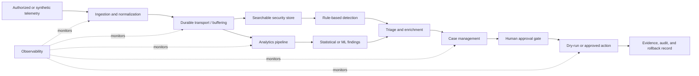

# Project Synapse Architecture

## Architectural intent

Project Synapse uses a modular, event-oriented architecture so that ingestion, storage, analytics, detection, case handling, response, and evidence can evolve independently. The design supports a small proof of concept first and makes the scale-out path explicit instead of assuming distributed scale from the beginning.

## Logical data path

## Responsibility boundaries

| Boundary | Responsibility | Candidate open-source components | Required contract |
|---|---|---|---|
| Ingestion | receive, validate, timestamp, and normalize events | Wazuh, collectors, webhooks | versioned event schema |
| Transport | decouple producers and consumers; absorb bursts | Kafka or equivalent | topic ownership, retention, delivery semantics |
| Search and storage | retain searchable security records | OpenSearch | index mapping, retention, tenant boundary |
| Analytics | compute trends, anomalies, features, and evaluation metrics | Python, Spark, notebooks | dataset version, transformation lineage |
| Detection | produce rule or model findings | Wazuh rules, analytics jobs | severity, confidence, evidence reference |
| Triage and cases | enrich, prioritize, assign, and record decisions | TheHive, Cortex, custom services | case state machine and correlation ID |
| Response | propose or execute a bounded action | SOAR/n8n/custom playbooks | authorization, dry-run, HITL, rollback |
| Evidence | preserve inputs, decisions, outputs, and limitations | EvidenceStore/audit store | immutable identifier and provenance |
| Observability | measure health, latency, errors, and resource use | Prometheus, Grafana, OpenTelemetry, Jaeger | metric names, trace context, alert thresholds |

Components are candidates until their integration is demonstrated. The project evaluates boundaries and evidence, not the popularity of a tool.

## Control planes

The architecture separates three types of control:

- **data plane** — security events, normalized records, analytics inputs, findings, and cases;
- **decision plane** — rules, model output, triage decisions, approval, and response policy;
- **management plane** — configuration, identity, secrets, observability, deployment, and evidence retention.

This prevents a detection result from automatically becoming a destructive action.

## Event contract baseline

Every normalized event should include, at minimum:

- `event_id`, `schema_version`, and `observed_at`;
- source type and sanitized source identifier;
- authorization/scope reference;
- event category, severity, and raw-evidence reference;
- correlation or trace identifier;
- tenant or lab boundary where applicable;
- processing status and error context.

Analytics and detections must reference the input dataset or event identifiers used to produce their result.

## Deployment evolution

### Stage A — constrained POC

- single host or small Docker Compose environment;
- synthetic or lab telemetry only;
- low-volume transport and storage;
- manual review of every sensitive action;
- baseline CPU, memory, storage, and latency measurements.

### Stage B — separated services

- independent ingestion, analytics, case, and evidence services;
- explicit queues and retry behavior;
- centralized secrets and observability;
- repeatable backup, restore, and failure exercises.

### Stage C — distributed validation

- partitioning by workload or authorized tenant;
- horizontal consumers and storage scaling;
- idempotent processing and replay;
- measured back-pressure, failover, and recovery;
- capacity conclusions tied to retained test data.

Moving between stages requires evidence; it is not implied by the architecture diagram.

## Reliability and safety invariants

1. `SOAR_DRY_RUN=true` is the default.
2. Sensitive actions require explicit human approval.
3. CDN and RFC1918 addresses are never automatically blocked.
4. DNS-derived events are `NOTIFY_ONLY`, never `BLOCK_IP`.
5. Raw operational data is not sent to external AI providers.
6. Connector or model failure fails closed and cannot bypass approval.
7. Every approved action retains input, decision, outcome, and rollback evidence.
8. Duplicate events and retries must be idempotent.

## Architecture evidence checklist

- [ ] current component and version inventory
- [ ] versioned event and case contracts
- [ ] updated logical and deployment diagrams
- [ ] one reproducible end-to-end integration
- [ ] negative tests for protected targets and approval bypass
- [ ] baseline latency, throughput, resource, and failure measurements
- [ ] backup, restore, and rollback exercise
- [ ] documented limitations and unresolved decisions
